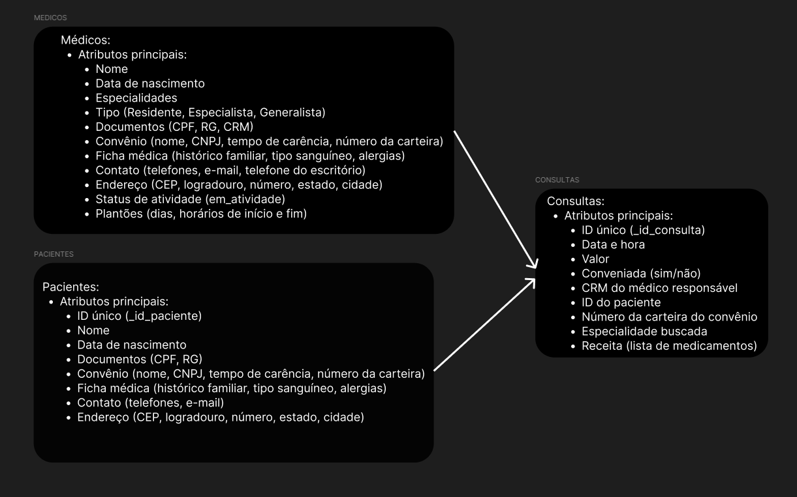
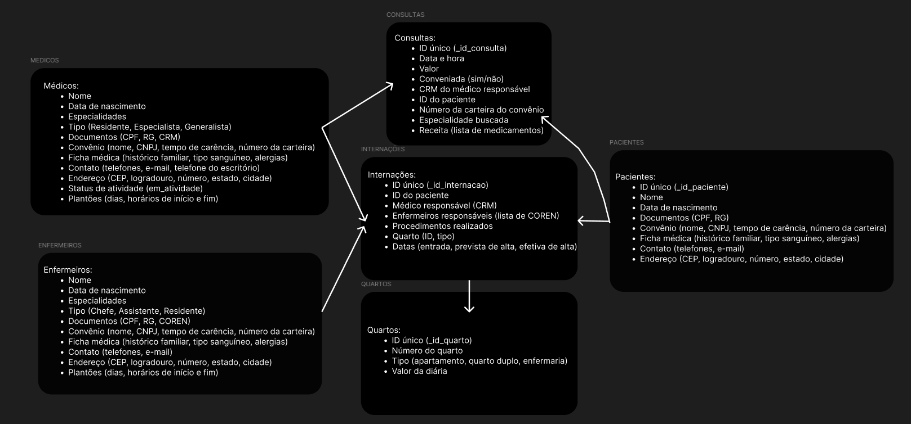

# 🏥 Hospital Fundamental

## Uma história para começar

Um hospital local precisa desenvolver um sistema para gerenciar seus dados clínicos e substituir planilhas e arquivos antigos por um banco de dados funcional.

O objetivo é criar uma estrutura que registre médicos, pacientes, consultas, convênios, receitas médicas e muito mais...

---

## Parte 1 - Mãos à Obra

Analise a seguinte descrição e extraia dela os requisitos para o banco de dados em um diagrama, fluxograma ou afins:

 O hospital necessita de um sistema para sua área clínica que ajude a controlar consultas realizadas. Os médicos podem ser generalistas, especialistas ou residentes e têm seus dados pessoais cadastrados em planilhas digitais. Cada médico pode ter uma ou mais especialidades, que podem ser pediatria, clínica geral, gastroenterologia e dermatologia. Alguns registros antigos ainda estão em formulário de papel, mas será necessário incluir esses dados no novo sistema.

 Os pacientes também precisam de cadastro, contendo dados pessoais (nome, data de nascimento, endereço, telefone e e-mail), documentos (CPF e RG) e convênio. Para cada convênio, são registrados nome, CNPJ e tempo de carência.

 As consultas também têm sido registradas em planilhas, com data e hora de realização, médico responsável, paciente, valor da consulta ou nome do convênio, com o número da carteira. Também é necessário indicar na consulta qual a especialidade buscada pelo paciente.

 Deseja-se ainda informatizar a receita do médico, de maneira que, no encerramento da consulta, ele possa registrar os medicamentos receitados, a quantidade e as instruções de uso. A partir disso, espera-se que o sistema imprima um relatório da receita ao paciente ou permita sua visualização via internet.

 **Exemplo de Requisitos do Banco de Dados:**

 A coleção de médicos, por exemplo, teria suas características definidas como segue:

 - `_id` (ObjectId)
 - `nome` (String)
 - `data_nascimento` (Date)
 - `especialidades` (Array de Strings) - Ex.: ["Pediatria", "Clínica Geral"]
 - `tipo` (String) - Ex.: "Generalista", "Especialista", "Residente"
 - `contato`: { `telefone` (String), `email` (String) }
 - `documentos`: { `CPF` (String), `RG` (String) }

📌 **Tarefa:** Crie o modelo do banco de dados com base na descrição acima.


---

## Parte 2 - Não era exatamente assim

Considere a seguinte descrição:

 No hospital, as internações têm sido registradas por meio de formulários eletrônicos que gravam os dados em arquivos.

 Para cada internação, são anotadas a data de entrada, a data prevista de alta e a data efetiva de alta, além da descrição textual dos procedimentos a serem realizados.

 As internações precisam ser vinculadas a quartos, com a numeração e o tipo.

 Cada tipo de quarto tem sua descrição e o seu valor diário (a princípio, o hospital trabalha com apartamentos, quartos duplos e enfermaria).

 Também é necessário controlar quais profissionais de enfermaria estarão responsáveis por acompanhar o paciente durante sua internação. Para cada enfermeiro(a), é necessário nome, CPF e registro no conselho de enfermagem (COREN).

 A internação, obviamente, é vinculada a um paciente – que pode se internar mais de uma vez no hospital – e a um único médico responsável.

📌 **Tarefa:** Modele os dados de internação conforme a descrição.


---

## Parte 3 - Jogando nas regras que você criou

Crie scripts de povoamento dos documentos desenvolvidos na atividade anterior.

📌 **Atividades obrigatórias:**

- ✅ Inclua ao menos 12 médicos de diferentes especialidades.
- ✅ Ao menos sete especialidades (ex.: Pediatria, Clínica Geral, Gastroenterologia, Dermatologia).
- ✅ Inclua ao menos 15 pacientes.
- ✅ Registre 20 consultas de diferentes pacientes e diferentes médicos.
  - ✅ Alguns pacientes devem realizar mais de uma consulta.
  - ✅ As consultas devem ter ocorrido entre 01/01/2015 e 01/01/2022.
  - ✅ Pelo menos 10 consultas devem ter receituário com dois ou mais medicamentos.
- ✅ Relacione as internações com IDs de médicos e pacientes.
- ✅ Registre ao menos 7 internações.
  - ✅ Pelo menos 2 pacientes devem ter se internado mais de uma vez.
  - ✅ Pelo menos 3 quartos devem ser cadastrados.
  - ✅ As internações devem ter ocorrido entre 01/01/2015 e 01/01/2022.
- ✅ Inclua os tipos de quarto: apartamento, quarto duplo e enfermaria, com valores diferentes.
- ✅ Inclua dados de 10 profissionais de enfermaria.
- ✅ Associe cada internação a pelo menos 2 enfermeiros.
- ✅ Os dados de tipo de quarto, convênio e especialidade devem ser povoados no início do sistema.

---

## Parte 4 - Inserindo Dados

Pensando no banco que já foi criado para o Projeto do Hospital, realize algumas alterações nas coleções e nos dados usando comandos de **atualização e exclusão**:

📌 **Tarefas:**

- ✅ Crie um script que adicione uma coluna `em_atividade` para os médicos, indicando se ele ainda está atuando no hospital ou não.
     ```
     
     db.medicos.updateMany({}, { $set: { em_atividade: true } })
     
     ```
- ✅ Crie um script para atualizar ao menos dois médicos como **inativos** e os demais como **em atividade**.
    ```
    
    db.medicos.updateOne({
    {nome: "Fernanda Costa Santos"},
    {$set: {em_atividade: false}}
    })
    db.medicos.updateOne({
    {nome: "Fernanda Costa Santos"},
    {$set: {em_atividade: false}}
    })
    
    ```

---

## Parte 5 - Consultas para que te quero

Crie um script e nele inclua **consultas que retornem** os seguintes dados (responda abaixo em JSON):

### 1. Todos os dados e o valor médio das consultas do ano de 2020 e das que foram feitas sob convênio.

R: Valor médio das consultas conveniadas é R$ 325.95 e sem convênio é 349.20

```
db.consultas.aggregate([
  {
    $match: {
      data_consulta: { $gte: "2020-01-01", $lte: "2020-12-31" }
    }
  },
  {
    $group: {
      _id: null,
      valorMedio: { $avg: "$valor_consulta" }
    }
  }
])


```

### 2. Todos os dados das internações que tiveram data de alta maior que a data prevista para a alta.

```
db.internacoes.find({
  $expr: { $gt: ["$data_efetiva_alta", "$data_prevista_alta"] }
});
```

### 3. Receituário completo da primeira consulta registrada com receituário associado.

```
{
db.consultas.find({ receita: { $exists: true } }).sort({ data_consulta: 1 }).limit(1);
}
```

### 4. Todos os dados da consulta de maior valor e também da de menor valor (ambas as consultas não foram realizadas sob convênio).

R: Maior valor:
```
{
db.consultas.aggregate([
  { $match: { conveniada: false } }, 
  { $sort: { valor_consulta: -1 } }, 
  { $limit: 1 }                      
])
}
```

R: Menor valor
```
db.consultas.aggregate([
  { $match: { conveniada: false } }, 
  { $sort: { valor_consulta: 1 } }, 
  { $limit: 1 }                      
])
```

### 5. Todos os dados das internações em seus respectivos quartos, calculando o total da internação a partir do valor de diária do quarto e o número de dias entre a entrada e a alta.

```
{
db.internacoes.aggregate([
  {
    $addFields: {
      data_entrada_convertida: { $dateFromString: { dateString: "$data_entrada" } },
      data_alta_convertida: { $dateFromString: { dateString: "$data_efetiva_alta" } }
    }
  },
  {
    $addFields: {
      diasInternacao: {
        $dateDiff: {
          startDate: "$data_entrada_convertida",
          endDate: "$data_alta_convertida",
          unit: "day"
        }
      }
    }
  },
  {
    $lookup: {
      from: "quartos",
      localField: "id_quarto",
      foreignField: "_id_quarto",
      as: "detalhes_quarto"
    }
  },
  { $unwind: "$detalhes_quarto" },
  {
    $addFields: {
      total_internacao: { $multiply: ["$detalhes_quarto.valor_diaria", "$diasInternacao"] }
    }
  },
  {
    $project: {
      _id_internacao: 1,
      id_quarto: 1,
      diasInternacao: 1,
      total_internacao: 1,
      "detalhes_quarto.numero_quarto": 1,
      "detalhes_quarto.tipo_quarto": 1
    }
  }
])
}
```

### 6. Data, procedimento e número de quarto de internações em quartos do tipo “apartamento”.

```
{
db.internacoes.aggregate([
  {
    $match: { tipo_de_quarto: "apartamento" } 
  },
  {
    $project: {
      data_internacao: "$data_entrada", 
      procedimento: 1, 
      numero_quarto: "$numero_quarto", 
      _id: 0 
    }
  }
]);
}
```

### 7. Nome do paciente, data da consulta e especialidade de todas as consultas em que os pacientes eram menores de 18 anos na data da consulta e cuja especialidade não seja “pediatria”, ordenando por data de realização da consulta.

```
{
db.consultas.aggregate([
  {
    $addFields: {
      idade_no_dia: {
        $dateDiff: {
          startDate: { $dateFromString: { dateString: "$data_de_nascimento" } },
          endDate: { $dateFromString: { dateString: "$data_consulta" } },
          unit: "year"
        }
      }
    }
  },
  {
    $match: {
      idade_no_dia: { $lt: 18 }, 
      especialidade: { $ne: "pediatria" } 
    }
  },
  {
    $sort: { data_consulta: 1 } 
  },
  {
    $project: {
      _id: 0,
      nome_paciente: 1,
      data_consulta: 1,
      especialidade: 1
    }
  }
])
}
```

### 8. Nome do paciente, nome do médico, data da internação e procedimentos das internações realizadas por médicos da especialidade “gastroenterologia”, que tenham acontecido em “enfermaria”.

```
{
db.internacoes.aggregate([
  { $lookup: { from: "medicos", localField: "medico_responsavel", foreignField: "documentos.crm", as: "detalhes_medico" } },
  { $unwind: "$detalhes_medico" },
  { $match: { "detalhes_medico.especialidade": "gastroenterologia", tipo_de_quarto: "enfermaria" } },
  { $project: { nome_paciente: 1, nome_medico: "$detalhes_medico.nome", data_internacao: "$data_entrada", procedimentos: 1 } }
])
}
```

### 9. Os nomes dos médicos, seus CRMs e a quantidade de consultas que cada um realizou.

```
{
db.consultas.aggregate([
  {
    $group: {
      _id: "$crm", // Agrupando por CRM do médico responsável
      numero_consultas: { $sum: 1 } 
    }
  },
  {
    $lookup: {
      from: "medicos", // Nome da coleção de médicos
      localField: "_id", // Campo agrupado (CRM)
      foreignField: "documentos.crm", 
      as: "detalhes_medico"
    }
  },
  { 
    $unwind: { path: "$detalhes_medico", preserveNullAndEmptyArrays: true } 
  },
  {
    $project: {
      _id: 0, // Remove o ID do agrupamento
      nome_medico: "$detalhes_medico.nome", 
      crm: "$_id", // CRM do médico
      numero_consultas: 1 
    }
  }
])
}
```

### 10. Todos os médicos que tenham "Gabriel" no nome.

```
{
db.medicos.find({
nome: /Gabriel/
})
}
```

### 11. Os nomes, CORENs e número de internações de enfermeiros que participaram de mais de uma internação.

```
{
db.internacoes.aggregate([
  // Desnormalizar o array de enfermeiras_responsaveis
  { $unwind: "$enfermeiras_responsaveis" },
  {
    $group: {
      _id: "$enfermeiras_responsaveis",
      totalInternacoes: { $sum: 1 }
    }
  },
  { $match: { totalInternacoes: { $gt: 1 } } },
  {
    $lookup: {
      from: "enfermeiros",
      localField: "_id",
      foreignField: "documentos.coren",
      as: "detalhesEnfermeiro"
    }
  },
  {
    $project: {
      coren: "$_id",
      nome: { $arrayElemAt: ["$detalhesEnfermeiro.nome", 0] },
      totalInternacoes: 1
    }
  }
])
}
```

---
📎 **Importante:** Utilize sempre o padrão de modelagem NoSQL orientado a documentos (MongoDB) e utilize referências (`ObjectId`) quando necessário entre coleções (ex.: pacientes, médicos, quartos, etc.).

🧪 Este repositório deve conter scripts e exemplos para fins de testes, aprendizado e desenvolvimento.
